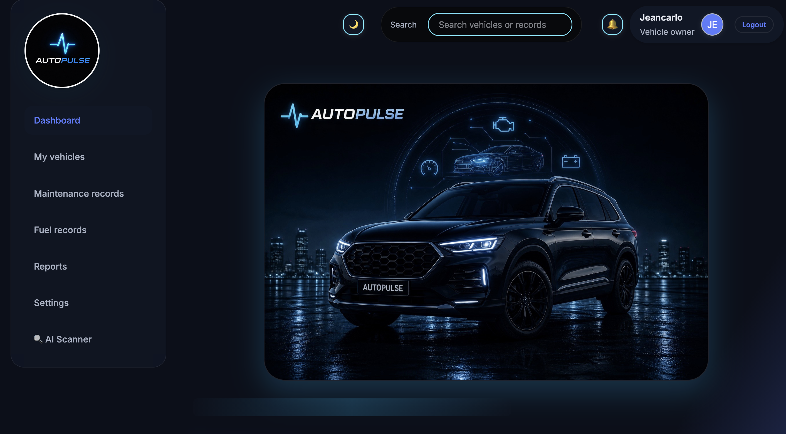
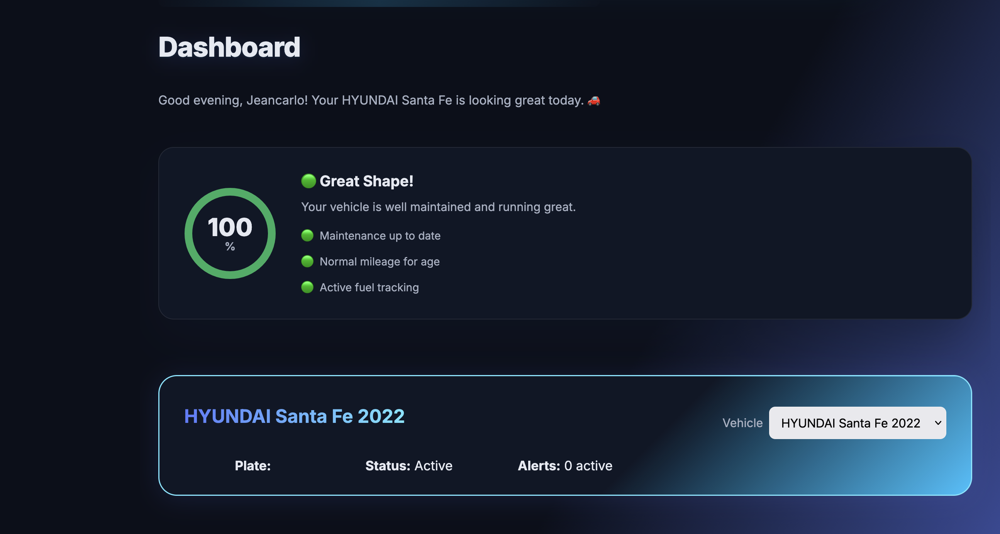
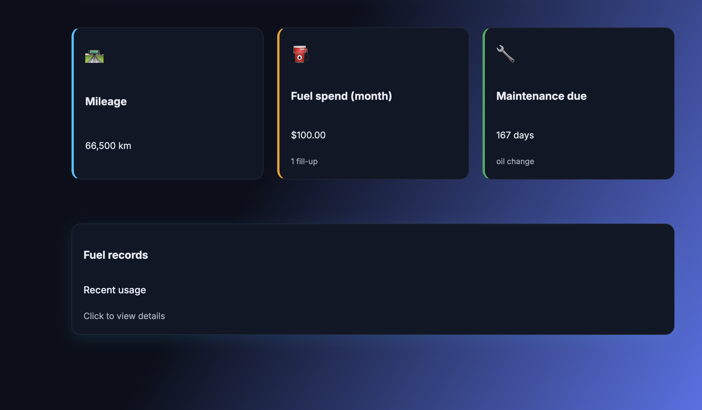
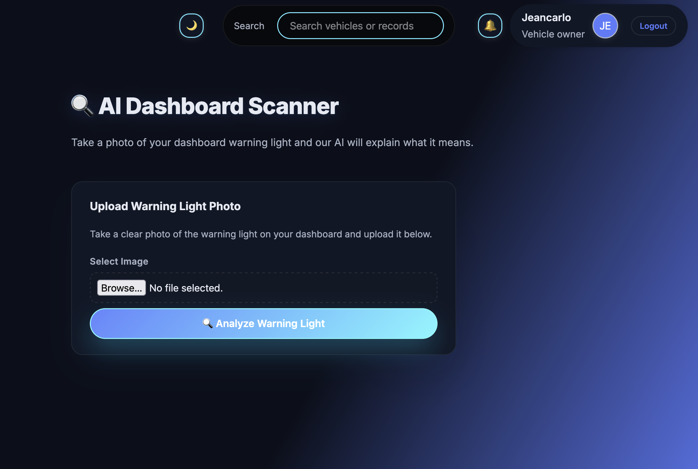
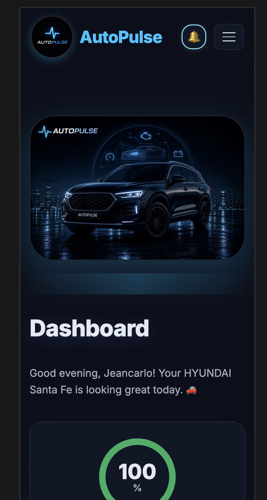
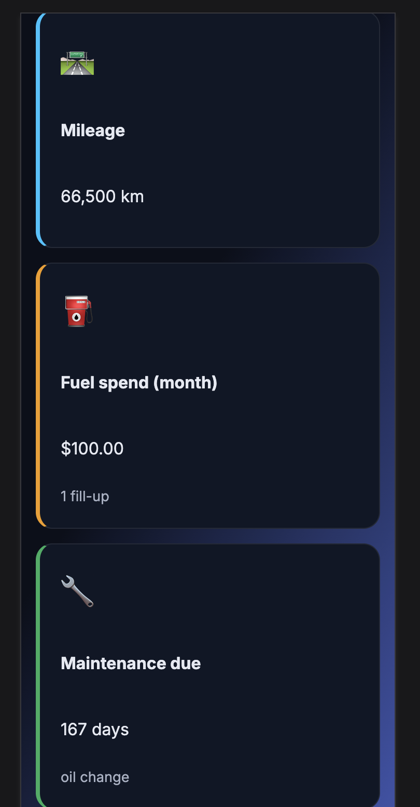
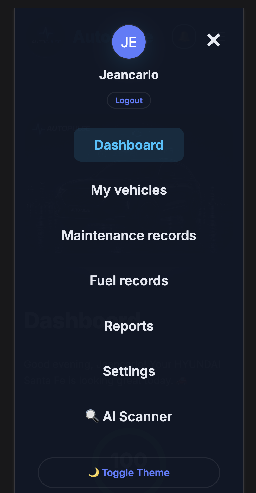

# 🚗 AutoPulse — Smart Vehicle Management Platform

> **AutoPulse** is a full-stack Progressive Web App (PWA) that helps vehicle owners track fuel, maintenance, and costs — powered by real-time AI diagnostics and smart weather alerts.

🌐 **Live Demo:** [autopulse-production-09cc.up.railway.app](https://autopulse-production-09cc.up.railway.app)

---

## ✨ Features

### 🔍 AI Dashboard Scanner
Upload a photo of any dashboard warning light and get an instant AI-powered diagnosis — what it means, severity level, and what to do next. Powered by **Claude Haiku (Anthropic)**.

### 🏥 Vehicle Health Score
A dynamic health score (0–100%) calculated from maintenance history, mileage, and activity. Includes an animated ring indicator and smart recommendations.

### 🚘 VIN Lookup
Enter your 17-digit VIN and AutoPulse automatically fills in your vehicle's make, model, year, trim, engine, fuel type, and vehicle category using the **NHTSA API** — no manual entry needed.

### ❄️ Smart Weather Alerts (Canada-focused)
Real-time temperature-based notifications using **Open-Meteo API**:
- 🔋 Battery warnings at -10°C and -20°C
- 🌡️ Tire pressure alerts at -5°C
- 🧴 Washer fluid reminders at 0°C
- ❄️ Black ice warnings at 3°C

### 🔔 Smart Notifications
Automatic in-app notifications for maintenance reminders, weather alerts, and vehicle health updates — with badge count and mark-as-read functionality.

### ⛽ Fuel Records
Log fill-ups and track monthly fuel spend, average consumption, and best efficiency. Includes a quick fuel efficiency calculator.

### 🔧 Maintenance Records
Track all service history with next service date reminders, overdue alerts, and a visual timeline.

### 📊 Reports & Export
Visualize fuel efficiency trends and monthly costs with Chart.js. Export your data as CSV.

### 🌙 Dark / Light Mode
Full theme toggle with smooth transitions, persisted across sessions.

### 📱 Progressive Web App (PWA)
Installable on mobile and desktop. Works offline with Service Worker caching.

---

## 🛠️ Tech Stack

| Layer | Technology |
|---|---|
| Frontend | HTML5, CSS3, JavaScript (Vanilla) |
| Backend | PHP 8.2 |
| Database | MySQL |
| AI | Claude Haiku (Anthropic API) |
| Weather | Open-Meteo API (free, no key needed) |
| VIN Lookup | NHTSA vPIC API (free) |
| Charts | Chart.js |
| Hosting | Railway |
| CI/CD | GitHub → Railway (auto-deploy) |
| PWA | Service Worker + Web App Manifest |

---

## 🗄️ Database Schema

```
autopulse_db
├── users              — Auth (email + bcrypt password)
├── vehicles           — Vehicle registry with VIN
├── fuel_records       — Fuel fill-up history
├── maintenance_records — Service history & reminders
├── favorites          — Saved vehicles
├── comparisons        — Vehicle comparisons
└── notifications      — Smart in-app alerts
```

---

## 🚀 Getting Started (Local)

### Prerequisites
- XAMPP (Apache + MySQL + PHP)
- Git

### Installation

```bash
# Clone the repo
git clone https://github.com/jeanvq/AutoPulse.git

# Move to XAMPP htdocs
cp -r AutoPulse /Applications/XAMPP/xamppfiles/htdocs/

# Start Apache and MySQL in XAMPP
```

### Database Setup

1. Open phpMyAdmin at `http://localhost/phpmyadmin`
2. Create database `autopulse_db`
3. Import the schema from `database/schema.sql`

### Configuration

Create `config/db.php` based on `config/db.example.php`:

```php
$host     = "localhost";
$dbname   = "autopulse_db";
$username = "root";
$password = "";
```

For the AI Scanner, set your Anthropic API key:

```bash
# In api/ai_scan.php (local only, not committed)
$apiKey = "your-anthropic-api-key";
```

### Run

```
http://localhost/AutoPulse
```

---

## 🌐 Deployment

AutoPulse is deployed on **Railway** with automatic deployments triggered on every `git push` to `main`.

Environment variables configured in Railway:
- `MYSQLHOST` / `MYSQLDATABASE` / `MYSQLUSER` / `MYSQLPASSWORD` / `MYSQLPORT`
- `ANTHROPIC_API_KEY`

---

## 📸 Screenshots

### Desktop View


### My Vehicles


### Fuel Records


### AI Dashboard Scanner


### Mobile Dashboard & Health Score


### Dashboard Stats


### Navigation Menu


---

## 🔒 Security

- Passwords hashed with `password_hash()` (bcrypt)
- API keys stored as environment variables (never in code)
- SQL injection prevention with PDO prepared statements
- GitHub Secret Scanning protection enabled

---

## 👨‍💻 Author

**Jeancarlo** — Full Stack Developer  
Built as a Capstone Project

---

## 📄 License

This project is for educational purposes as part of a college capstone.

---

> *AutoPulse — Because your car deserves smart care.* 🚗⚡
