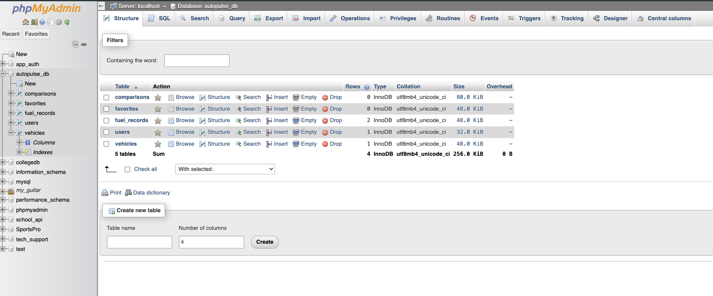
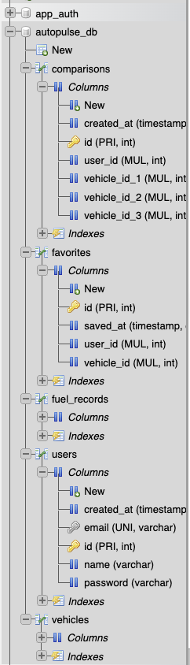

# AutoPulse

AutoPulse is a full-stack web project (frontend + backend) focused on vehicle and fuel management. It provides a modern client-side experience while connecting to PHP API endpoints and a database for persistent data.

## Project Type

- Frontend project: user interface, interactions, and PWA behavior.
- Backend project: PHP API endpoints for authentication, vehicles, and fuel records.

## Tech Stack

### Frontend

- HTML
- CSS
- JavaScript
- Service Worker + Web App Manifest (basic PWA setup)

### Backend

- PHP
- REST-style API endpoints in `api/`
- Database connection and config in `config/db.php`

## Main Structure

- `index.html` (main dashboard)
- `auth.html` (login/register UI)
- `styles.css` and `auth.css` (styling)
- `app.js` and `auth.js` (frontend logic)
- `manifest.json` and `sw.js` (PWA files)
- `api/` (server-side endpoints)
- `config/` (database config)

## Backend Endpoints

- `api/login.php`
- `api/signup.php`
- `api/get_vehicles.php`
- `api/add_vehicle.php`
- `api/delete_vehicle.php`
- `api/get_fuel.php`
- `api/add_fuel.php`

## Image Gallery

All images from the `images/` folder are included below:

