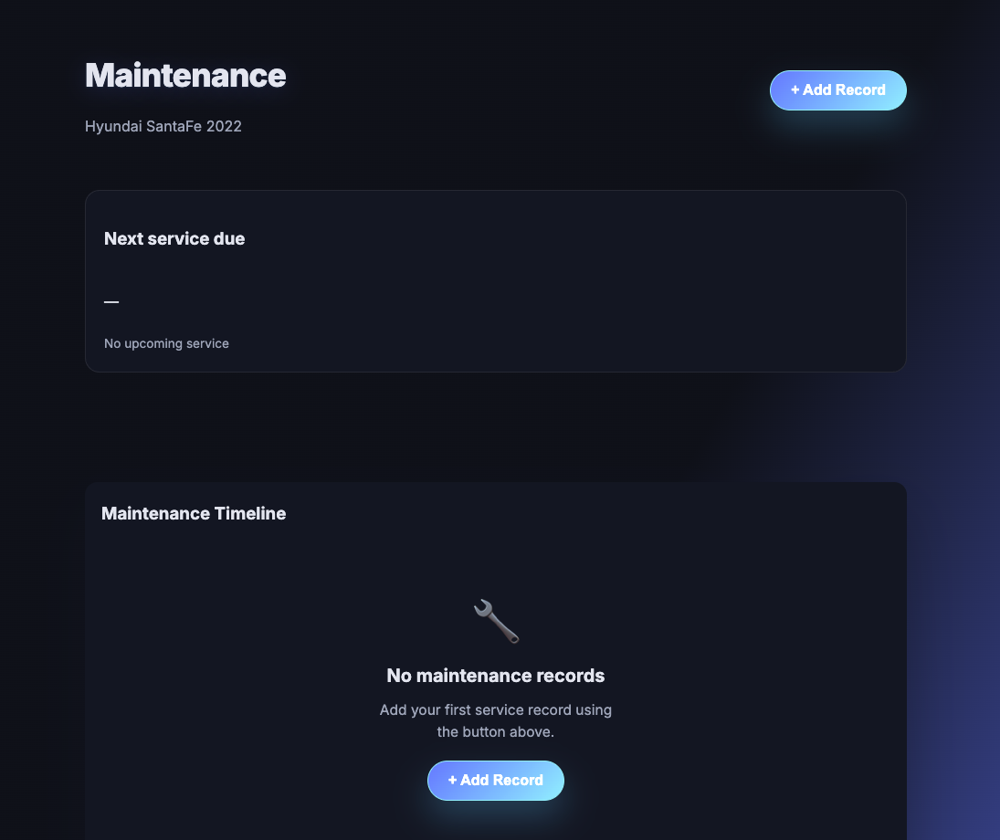
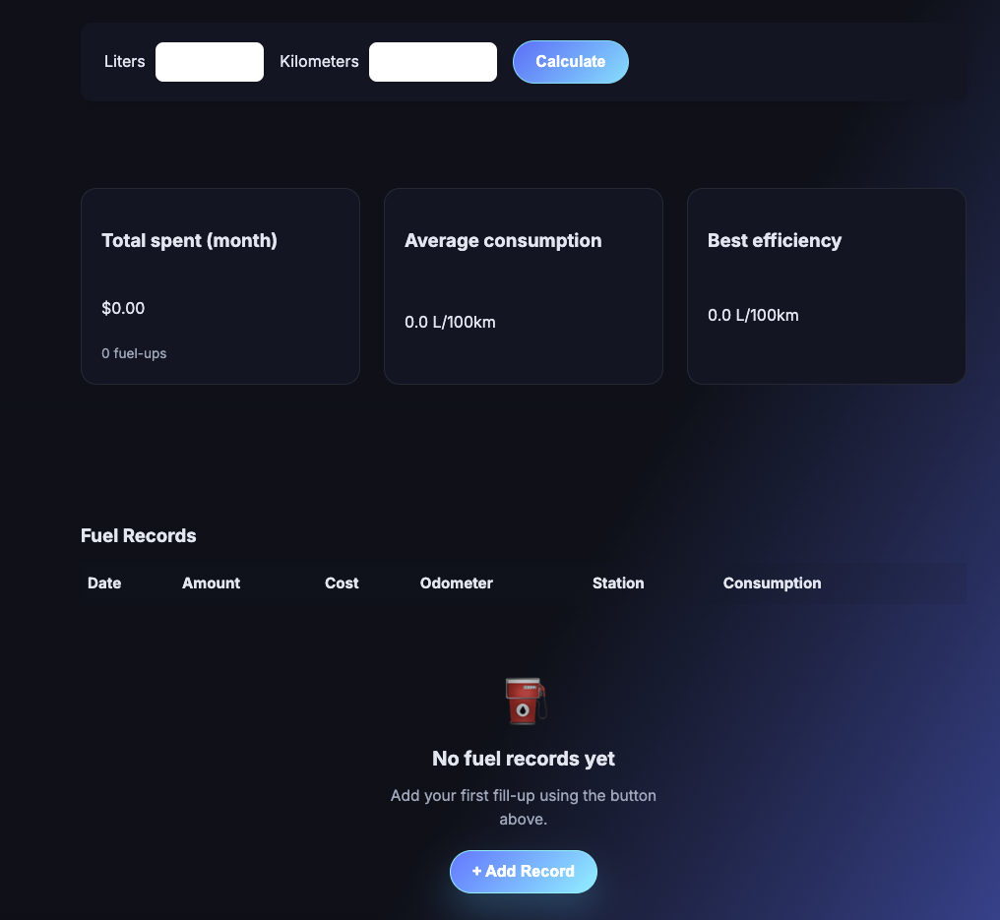
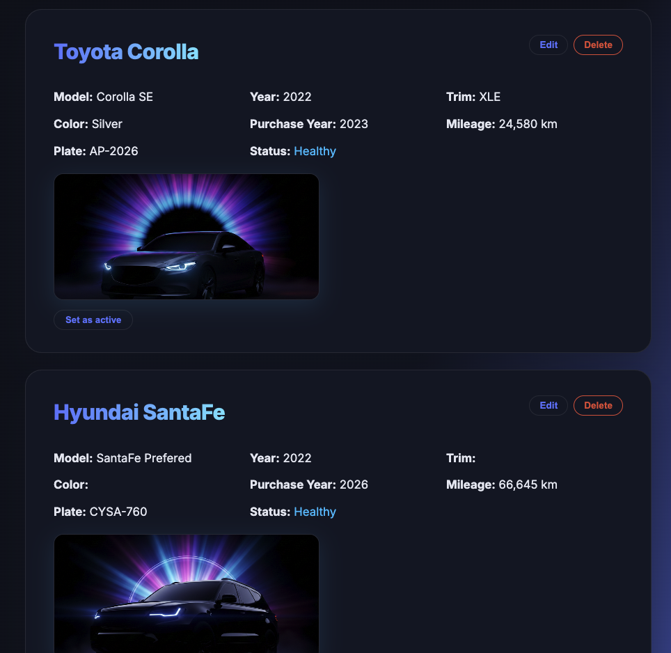
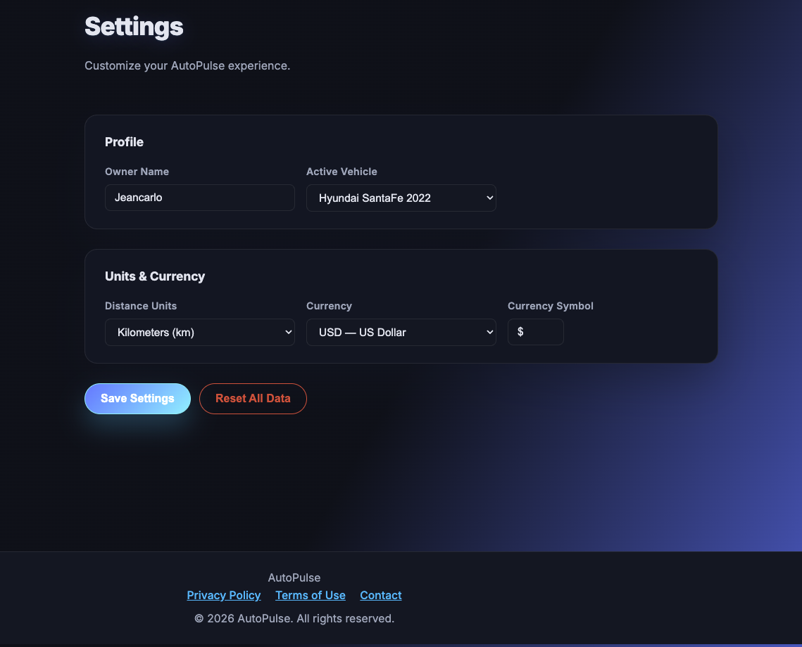
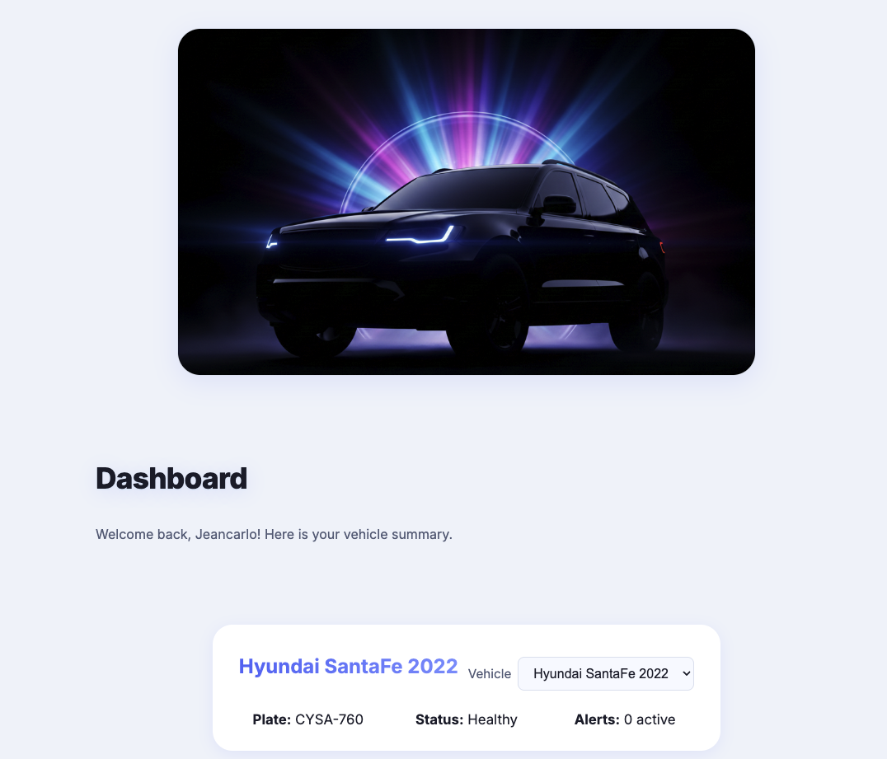
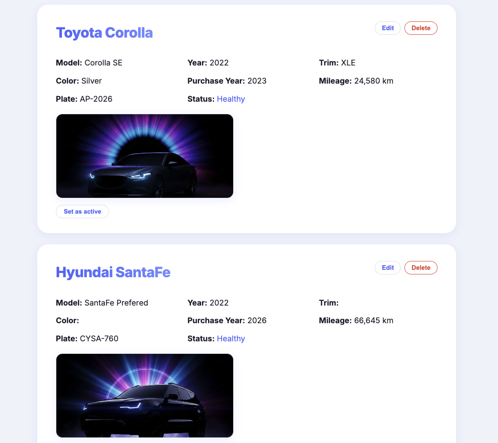

# AutoPulse

AutoPulse es una aplicacion web para explorar vehiculos por categoria, comparar opciones y guardar favoritos en una interfaz rapida y responsiva.

## Tecnologias

- HTML
- CSS
- JavaScript
- Service Worker (PWA basico)

## Estructura principal

- `index.html`
- `styles.css`
- `app.js`
- `manifest.json`
- `sw.js`

## Galeria

